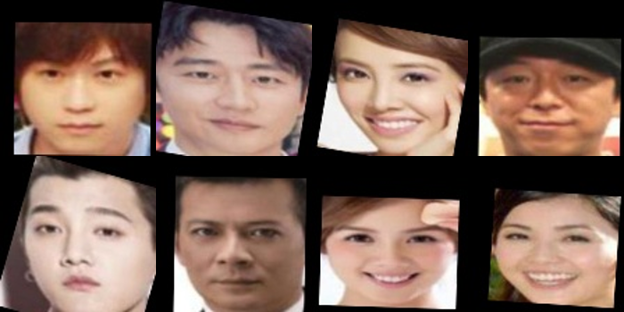
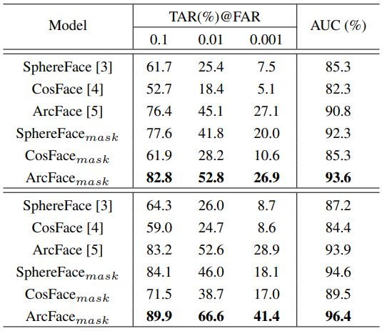
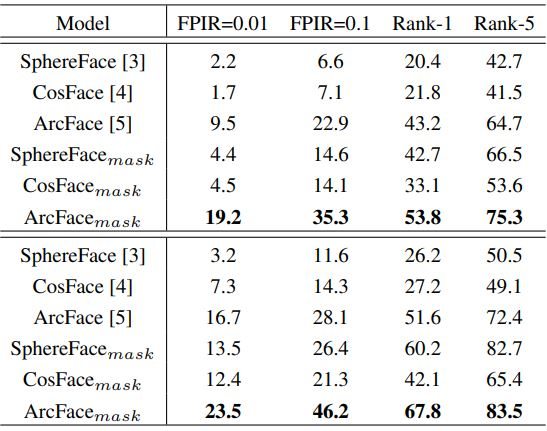
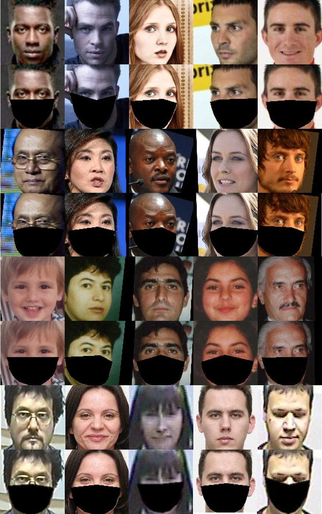

# Masked-Face-Recognition

Overview:
--
1. We manually clean the RMFRD dataset by removing the images which are difficult to verify, and wind up with a cleaned version of the RMFRD, or the c-RMFRD in short. The c-RMFRD has 831 masked faces of 248 subjects and 3,627 images of the same 248 subjects without masks.
  <p align="left"></p>

2. We provide two trained model for face verification and identification.

3. The **code** can add on a synthetic mask to each face in a dataset, offering an efficient solution to the lack of facial mask databases. This solution is helpful to the studies on face detection and recognition against facial masks.

Result:
--
Verification and Identification rates for the loss functions tested on the c-RMFRD.
<p align="left"></p>
<p align="left"></p>

Pre-requisites:
--
- Python3
- Opencv
- Pandas
- Mtcnn_detector

How to use:
--
1. Clone the Repository to preserve Directory Structure.
2. In **/sample/** directory, we provide 3 images to test the mask generator.
3. In **/landmark/test.csv**, we provide the 68 landmarks and face types for 3 samples. 
4. To generate the masks for samples, run the following commands:
```python make_mask.py ```

```bash
Definition of the face types : 

Example : 0_1 
The first number "0" means the facial image is frontal and "1" means the facial image is profile.
The second number "0" means the facial image is clear and "1" means the facial image is blur.
```

Result:
--
<p align="left"></p>

Citation:
--
```
```

Please feel free to contact us if you have any questions. Prof. Gee-Sern Jison Hsu e-mail: jison@mail.ntust.edu.tw
